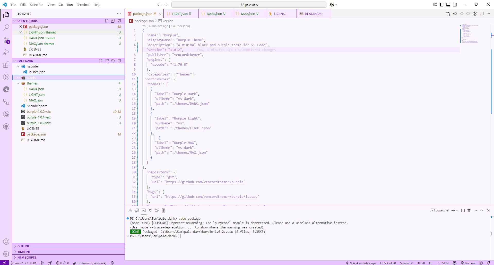
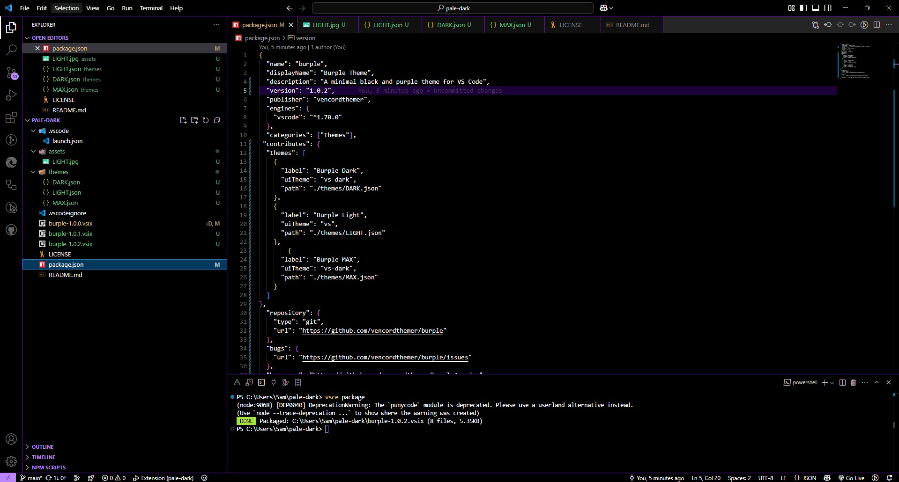
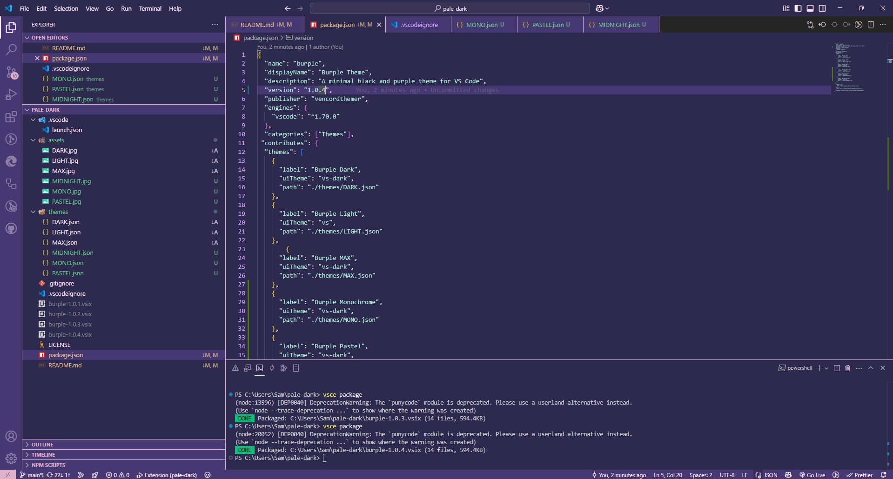
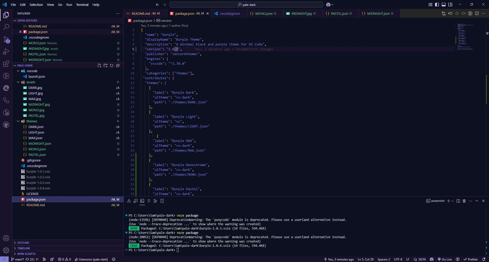
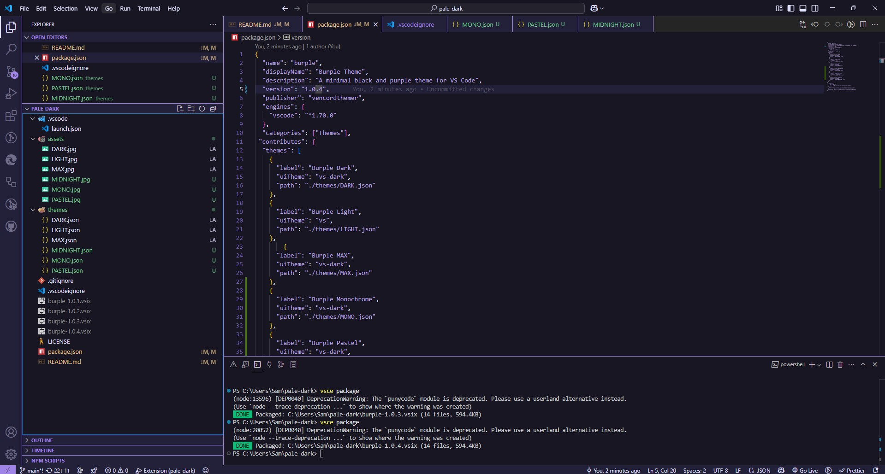
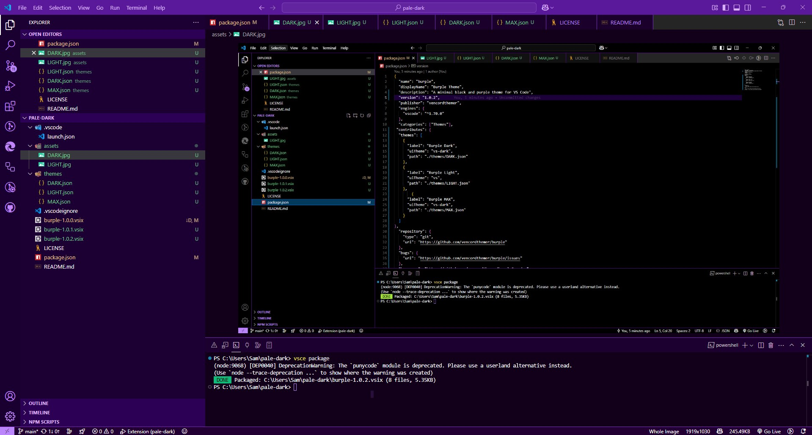

# 🎨 Burple Theme for VS Code

Welcome to the **Burple** family — a sleek, modern Visual Studio Code theme collection designed around vibrant purples, clean UI contrast, and developer comfort.

## 💡 Theme Variants

| Theme Name         | Type  | Description                                                                                   |
|--------------------|-------|-----------------------------------------------------------------------------------------------|
| **Burple Light**   | Light | Bright, clean UI with elegant purple accents for a smooth daytime coding experience.           |
| **Burple Dark**    | Dark  | Deep blacks with balanced purples and glowing highlights for low-light environments.           |
| **Burple Max**     | Dark  | A bold, high-energy purple overload. Perfect for those who want maximum aesthetic.             |
| **Burple Pastel**  | Dark  | Soft, gentle pastel purples and lavenders for a calming, dreamy coding atmosphere.             |
| **Burple Midnight**| Dark  | Ultra-dark backgrounds with rich, deep purples and midnight blue-magenta accents.              |
| **Burple Mono**    | Dark  | Minimalist monochrome with subtle purple highlights for a focused, distraction-free workspace. |

---

## ✨ Features

- 💜 Beautifully blended purple tones across UI and syntax
- 🌙 Comfortable dark mode (Burple Dark / Max)
- ☀️ Crisp and readable light mode (Burple Light)
- 🧠 Thoughtfully chosen contrast for focus and legibility
- 🧩 Full VS Code UI theming (tabs, sidebar, status bar, etc.)
- 🎯 Clean syntax highlighting with italic comments and distinct scopes

---

## 📷 Screenshots

Light Mode:

Dark Mode:

Pastel Mode:

Midnight Mode:

Monochrome Mode:

MAX:

---

## 📦 Installation

### Option 1: Install from VSIX

1. [Download the latest `.vsix`](https://github.com/vencordthemer/burple/releases).
2. Open VS Code → Command Palette (`Ctrl+Shift+P` or `Cmd+Shift+P`)
3. Run `Extensions: Install from VSIX...`
4. Choose your favorite Burple variant via `Preferences: Color Theme`

### Option 2: Install from marketplace

Open it in VSCode using this link: <vscode:extension/vencordthemer.burple>, Then click install

